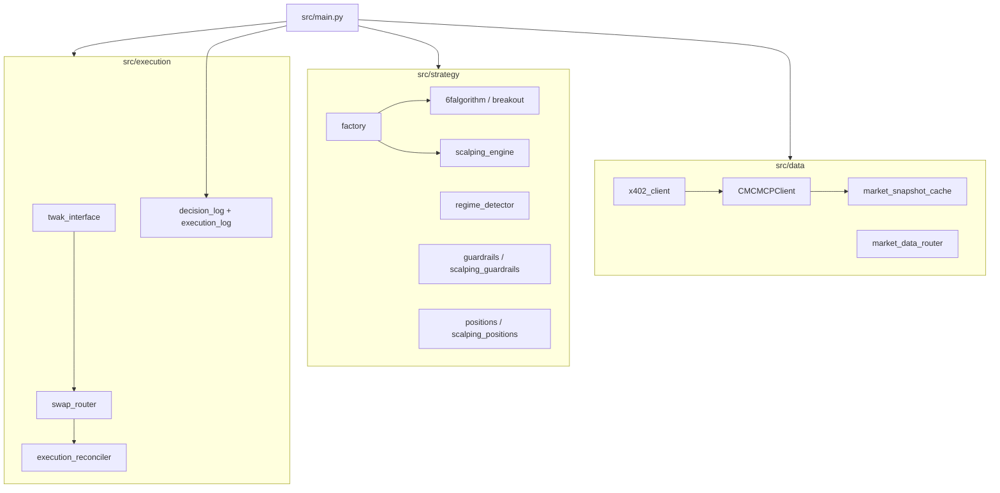
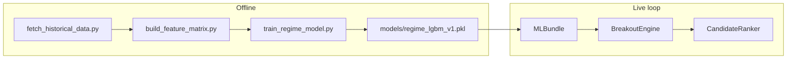

<div align="center">

# NoNamedYet_Bot

**Autonomous BSC trading agent for the BNB Hack — AI Trading Agent Edition**

*Rule-based momentum & scalping · TWAK self-custody execution · CMC market data · strict guardrails*

<br/>

| | |
|:---:|:---:|
| **Chain** | BNB Smart Chain (BSC) |
| **Agent schema** | `2.6.0` |
| **Default strategy** | `scalping` |
| **Loop interval** | `300s` (5 min) |
| **Tests** | `273+` pytest cases |

<br/>

</div>

[Quick Start](#quick-start) · [Run Modes](#run-modes) · [Strategy](#strategy-modes) · [Architecture](#architecture) · [Logs](#logs--telemetry)

---

## Overview

**NoNamedYet_Bot** is a production-minded Python trading agent that evaluates a focused universe of high-liquidity BNB Chain tokens, applies regime-aware guardrails, and executes swaps through **TWAK** — so Python never holds a trading private key.

| Design principle | What it means |
| --- | --- |
| **ML is additive only** | LightGBM regime detection and ranking augment the 4-factor gate — never replace it |
| **No custom execution server** | All writes go through verified TWAK CLI subprocesses |
| **Fail-closed risk** | Slippage, drawdown, and daily limits block entries before capital moves |
| **Append-only audit trail** | Every cycle and swap is logged to JSONL for replay and demo proof |

> **Onboarding tip:** `context.md` is the engineer handoff — verified proofs, env quirks, and open blockers live there.

---

## What it does today

Each trading cycle (every `LOOP_SECONDS`, default **5 minutes**):

```
┌─────────────┐    ┌──────────────┐    ┌─────────────┐    ┌──────────────┐
│ Fetch CMC   │───▶│ Detect regime│───▶│ Score tokens│───▶│ Guardrails   │
│ snapshot    │    │ + sentiment  │    │ (strategy)  │    │ check        │
└─────────────┘    └──────────────┘    └─────────────┘    └──────┬───────┘
                                                                  │
                    ┌──────────────┐    ┌──────────────┐            ▼
                    │ Reconcile tx │◀───│ TWAK swap    │◀─── ENTER or WAIT
                    │ on-chain     │    │ (live only)  │
                    └──────────────┘    └──────────────┘
```

1. **Market data** — CoinMarketCap trial REST quotes (and optional x402-paid enrichment when a micropayment signer is configured).
2. **Regime & sentiment** — BNB trend, Fear & Greed, funding, and gas inform risk posture.
3. **Strategy evaluation** — `breakout` (4-of-4 core factors) or `scalping` (weighted 0–100 score).
4. **Position management** — Monitor open trades every `POSITION_MONITOR_SECONDS`; exit on TP, SL, trailing stop, or time stop.
5. **Live execution** — TWAK quote-only slippage checks → swap → on-chain reconciliation before persisting local state.
6. **Telemetry** — Structured logs under `logs/` plus legacy `decision_log.jsonl` / `execution_log.jsonl`.

---

## Verified state

> Last audited: **2026-06-08**

| Capability | Status |
| --- | --- |
| TWAK CLI `0.17.0` swap + approval on BSC | ✅ Proven ([artifact](demo_artifacts/real_twak_swap_2026-06-04.md)) |
| Live balance reads via `bnb-chain-agentkit` | ✅ |
| Autonomous decision + execution JSONL logging | ✅ |
| On-chain execution reconciliation | ✅ |
| Dual CMC data path (REST + x402 enrichment) | ✅ Implemented |
| Autonomous loop producing a funded live swap | ⏳ Manual TWAK swap proven; loop micro-live pending |
| End-to-end paid CMC x402 in production | ⏳ Dual mode ready; full live proof pending |

**On-chain proof (manual TWAK run):**

| Action | Tx hash |
| --- | --- |
| Approval | `0x5863c33ba5fbfd7016fae9dfe062d853213b198376862fd76ce81336a20fe7d0` |
| Swap | `0x2b5db498c97d6c69af6718872feb749457e7e6434c17569a34a2f78ff64eda94` |

---

<a id="architecture"></a>

## Architecture



| Module | Responsibility |
| --- | --- |
| `src/main.py` | CLI, 5-minute agent loop, preflight, emergency liquidation |
| `src/data/` | CMC Keyless quotes, x402 micropayments, snapshot caching |
| `src/strategy/` | Breakout & scalping engines, regime, sentiment, guardrails |
| `src/execution/` | TWAK subprocess wrapper, swap routing, on-chain reconciliation |
| `src/config/` | Settings, token allowlists, env-only secrets |
| `src/ml/` | Feature pipeline, LightGBM regime predictor, candidate ranking (opt-in) |
| `scripts/` | Smoke tests, shadow replay, ML training/hyperopt, emergency shell helpers |

---

## ML augmentation layer (Plan B+)

Opt-in via `ML_ENABLED=true`. The 4 core breakout factors remain the **mandatory gate**; ML only adds regime context, position sizing, and candidate ranking when multiple tokens pass.



### Activation

```bash
pip install -r requirements-ml.txt
python scripts/fetch_historical_data.py      # Binance OHLCV + CMC premium snapshots
# Use --binance-only when x402/CMC deps are unavailable (OHLCV-only training)
python scripts/build_feature_matrix.py
python scripts/train_regime_model.py         # purged CV + 3-model comparison
python scripts/smoke_ml_inference.py         # verify <5ms inference latency
```

Review `MODEL_QUALITY_REPORT.md` after training. **ML ranking stays disabled** until worst-fold AUC ≥ `ML_MIN_AUC` (default 0.65) and you set `ML_SHADOW_MODE=false`.

Then in `.env`:

```
ML_ENABLED=true
ML_SHADOW_MODE=true
ML_MIN_AUC=0.65
STRATEGY_MODE=breakout
```

### What ML does (and does not do)

| Capability | Behavior |
| --- | --- |
| Regime detection | LightGBM binary classifier: momentum vs chop from 30 features (Binance OHLCV + CMC premium) |
| Position sizing | `1.0×` in momentum regime, `0.5×` in chop (configurable) |
| Candidate ranking | When 2+ tokens pass core factors, pick highest ML confidence |
| Hyperopt | `scripts/optimize_params.py` replays decision/execution logs with Optuna |
| **Cannot bypass** | Core factors, slippage cap, daily trade limits, drawdown kill switch |

Key env vars: `ML_REGIME_THRESHOLD`, `ML_MOMENTUM_SIZE_MULTIPLIER`, `ML_CHOP_SIZE_MULTIPLIER`, `ML_VOLUME_BREAKOUT_MULTIPLIER`, `ML_VOLUME_CACHE_MULTIPLIER`.

---

<a id="strategy-modes"></a>

## Strategy modes

Set `STRATEGY_MODE` in `.env` — default is **`scalping`**.

### Scalping *(default)*

Weighted score **0–100** across five factors. Entry requires `SCALPING_ENTRY_SCORE_MIN` (default **60**).

| Factor | Weight | Intent |
| ---: | ---: | --- |
| Micro momentum | 30 | Short-horizon price/volume impulse |
| Slippage OK | 25 | TWAK quote-only under cap |
| Regime neutral | 20 | Not fighting a risk-off tape |
| No whale dump | 15 | Avoid sharp sell pressure |
| Gas viable | 10 | BSC gas within scalping budget |

| Parameter | Default |
| --- | --- |
| Position size | 1% of portfolio |
| Take profit | +1.5% |
| Stop loss | −0.8% |
| Max hold | 30 min (time stop at 20 min) |
| Max slippage | 0.5% |
| Open positions | **1 at a time** |
| Daily trades | up to 10 |
| Daily loss cap | 2% |

### Breakout *(legacy)*

Four **mandatory** core factors (default `MIN_ENTRY_FACTORS=4`). Slippage always fail-closed.

| # | Core factor |
| ---: | --- |
| 1 | 1h volume > 2× rolling 24h hourly average |
| 2 | Price breaks 3h high (+ 0.2% buffer) |
| 3 | BNB 1h trend not sharply risk-off |
| 4 | TWAK quote-only slippage < 1% |

Optional ranking factors: RSI band (55–75) and derivatives risk clearance.

| Parameter | Default |
| --- | --- |
| Position size | up to 5% of portfolio |
| Trailing stop | 3.5% below peak |
| Take profit | +8% |
| Max daily trades | 3 |
| Max daily loss | 3% → 24h pause |

---

## Risk guardrails

> Guardrails are **never** bypassed for demo or competition windows.

| Control | Breakout | Scalping |
| --- | --- | --- |
| Tradable allowlist | `TRADABLE_TARGET_SYMBOLS` only | same |
| Drawdown soft stop | 10% | inherited |
| Drawdown kill switch | 15% → liquidate & halt | inherited |
| Max swap slippage | 1% | 0.5% |
| Consecutive loss cooldown | — | 3 stops → 1h pause |
| Emergency liquidation | `python -m src.main --emergency-liquidate` | same |

Stables (USDC / USDT) are settlement tokens — not directional entry targets.

---

<a id="quick-start"></a>

## Quick start

```bash
python -m venv .venv
source .venv/bin/activate
pip install -r requirements.txt
cp .env.example .env
```

Edit `.env` with RPC URLs, wallet address, and TWAK unlock before live trading.

**Required for live mode:**

```env
BSC_PROVIDER_URL=...
AGENT_WALLET_ADDRESS=...
WALLET_ADDRESS=...
PAPER_TRADE=false
```

**TWAK wallet unlock** (pick one):

```bash
# Preferred — OS keychain
twak wallet keychain save --password '<wallet-password>'
twak wallet keychain check

# Or local-only (never commit)
TWAK_WALLET_PASSWORD=...
```

```bash
pytest
```

---

<a id="run-modes"></a>

## Run modes

| Command | Description |
| --- | --- |
| `python -m src.main --paper-trade` | Deterministic paper execution *(default when neither flag is set)* |
| `python -m src.main --live` | Live TWAK swaps on BSC |
| `python -m src.main --live --preflight` | Readiness checks — no broadcasts |
| `python -m src.main --live --once` | Single cycle then exit |
| `python -m src.main --live --demo-mode` | Compact per-cycle stdout summary |
| `python -m src.main --live --balance` | Print wallet balances and exit |
| `python -m src.main --emergency-liquidate` | Sell open positions → USDC |
| `python -m src.main --live --withdraw SYMBOL --to 0x… --amount N` | Transfer tokens out |

**Examples:**

```bash
# Paper loop (safe default)
python -m src.main --paper-trade

# Live with preflight first
python -m src.main --live --preflight
python -m src.main --live

# Dry-run emergency exit
python -m src.main --emergency-liquidate --paper-trade
```

---

## Market data

Three paths — configured via `.env`:

| Mode | Env | Behavior |
| --- | --- | --- |
| **Dual** *(default live)* | `USE_DUAL_MARKET_DATA=true` | Trial REST every loop; x402 enrichment on `CMC_SNAPSHOT_TTL_SECONDS` cadence |
| **Keyless only** | `USE_KEYLESS_PRIMARY=true` | Trial REST snapshots only |
| **MCP shadow** | `CMC_MCP_ENABLED=true` + `CMC_MCP_SHADOW_MODE=true` | Exercise x402 MCP without affecting trading data |

x402 micropayments use `CMC_X402_EPHEMERAL_KEY` (isolated in `src/data/` — **not** the TWAK trading wallet).

**Verified TWAK commands:**

```bash
twak wallet create
twak compete register
twak wallet address --chain bsc --json
twak swap <amount> <from> <to> --slippage <pct> --chain bsc --quote-only --json
twak swap <amount> <from> <to> --slippage <pct> --chain bsc --json
twak x402 pay --url <endpoint> --amount <amount> --asset <token> --chain base --json
```

> Internal slippage is stored as a fraction (`0.01` = 1%). TWAK CLI expects percent (`--slippage 1`).

**Smoke scripts:**

```bash
python scripts/smoke_cmc_mcp.py
python scripts/smoke_cmc_x402_paid_quote.py
python scripts/replay_shadow.py
```

---

<a id="logs--telemetry"></a>

## Logs & telemetry

### Structured (`logs/`)

| File | Contents |
| --- | --- |
| `decision_live.jsonl` | Per-cycle ENTER / WAIT / BLOCKED / HALT with factor scores |
| `portfolio_snapshots.jsonl` | Portfolio value, drawdown, open positions |
| `risk_events.jsonl` | Kill switch, pause, and limit breaches |
| `sentiment_live.jsonl` | FGI, funding, gas snapshots |
| `decision_shadow.jsonl` | Parallel strategy variants for research |

### Legacy (root)

| File | Contents |
| --- | --- |
| `decision_log.jsonl` | Compact strategy decisions |
| `execution_log.jsonl` | Swap attempts, tx hashes, errors |

Override paths with `DECISION_LOG_PATH`, `EXECUTION_LOG_PATH`, `POSITION_STATE_PATH`, and `GUARDRAIL_STATE_PATH`.

---

## Key environment variables

<details>
<summary><strong>Click to expand full env reference</strong></summary>

```env
# Strategy
STRATEGY_MODE=scalping          # or "breakout"
LOOP_SECONDS=300
POSITION_MONITOR_SECONDS=60

# Market data
USE_DUAL_MARKET_DATA=true
CMC_SNAPSHOT_TTL_SECONDS=7200
CMC_KEYLESS_SNAPSHOT_TTL_SECONDS=300
USE_KEYLESS_PRIMARY=false
CMC_MCP_ENABLED=false
CMC_MCP_SHADOW_MODE=false

# x402 (Base micropayments for CMC enrichment)
CMC_X402_EPHEMERAL_KEY=
CMC_X402_AMOUNT=0.01
CMC_X402_ASSET=0x833589fCD6eDb6E08f4c7C32D4f71b54bdA02913
CMC_X402_CHAIN_ID=8453

# Risk (breakout defaults shown; scalping has separate caps in settings.py)
MAX_POSITION_PCT=0.05
MAX_DAILY_TRADES=3
MAX_DAILY_LOSS_PCT=0.03
DRAWDOWN_KILL_SWITCH_PCT=0.15
MIN_ENTRY_FACTORS=4
```

See `src/config/settings.py` and `.env.example` for the complete list.

</details>

---

## Known gaps

- [ ] Autonomous loop has not yet persisted a **funded micro-live** swap end-to-end (manual TWAK swap is proven).
- [ ] Paid CMC x402 enrichment is wired but awaits full production proof.
- [ ] MEV/sandwich cost on PancakeSwap is acknowledged in scalping docs but not modeled in backtests.
- [ ] Unattended production should harden state recovery beyond JSON file persistence.

---

## Project layout

```
NoNamedYet_Bot/
├── src/
│   ├── main.py              # Agent loop & CLI
│   ├── config/              # Settings, tokens, secrets
│   ├── data/                # CMC + x402 clients
│   ├── execution/           # TWAK, swaps, reconciliation
│   └── strategy/            # Breakout, scalping, regime, guardrails
├── tests/                   # Pytest suite
├── scripts/                 # Smoke & ops helpers
├── logs/                    # Structured telemetry (gitignored contents)
├── demo_artifacts/          # On-chain proof writeups
├── .env.example
└── context.md               # Technical handoff for AI/engineering sessions
```

---

<div align="center">

**Built for BNB Hack Track 1** · TWAK self-custody · CoinMarketCap data · No private keys in Python

*Previously developed as Plan B+ — now **NoNamedYet_Bot***

</div>
